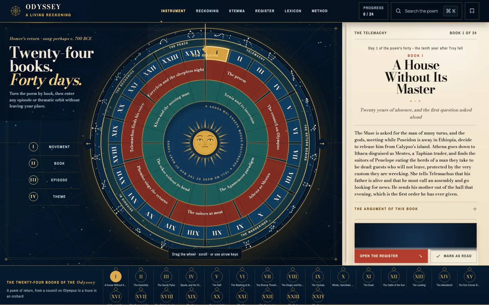
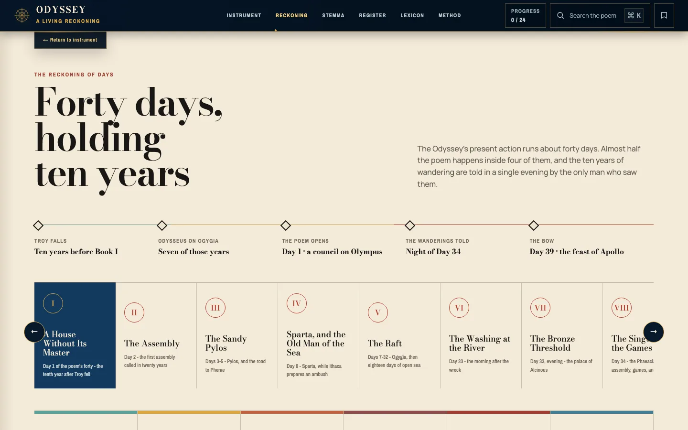
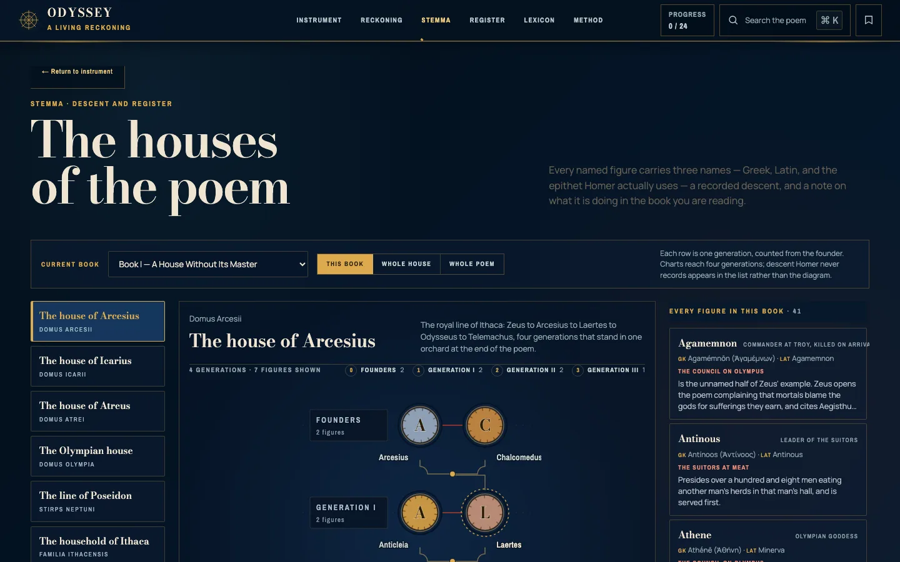

# Odyssey: A Living Reckoning

**Live: [{{PORTFOLIO_URL}}/demos/odyssey/]({{PORTFOLIO_URL}}/demos/odyssey/)** (best on a laptop)

A reading instrument for Homer's *Odyssey*, built to sit beside the print text.
It is the sibling of my [Metamorphoses instrument](https://metamorphoses-chronology.vercel.app/)
and uses the same design.



## Why it exists

The Odyssey tells its story out of order. About forty days of present action
hold ten years of wandering, and those years are told in one night by the only
witness to them. Read book by book, it is easy to lose track of who someone is
and whose account you are hearing.

## What is in it

- **The wheel.** A draggable, keyboard-operable four-ring wheel (movement, book,
  episode, theme). The six movements on the outer ring are the poem's own
  architecture: the Telemachy, the Return Begins, the Wanderings, Ithaca in
  Disguise, the Reckoning, and the Peace.
- **185 episodes**, each with a plain account of what happens, a fuller reading,
  the hinge, the aftermath, sources, a craft note, the afterlife and
  close-reading prompts. Where Ovid's poem turns on transformation, this one
  turns on return, so each episode names its turn: "Nobody → Odysseus",
  "Stranger → guest", "Beggar → king".
- **The reckoning.** Two clocks: the day count of the poem's present, and the
  order you read in. When a book reports events from outside its own day, the
  interface says whose report it is.
- **297 figure records** with 798 per-episode notes, each with a Greek name, a
  Latin name and the epithet Homer actually uses.
- **17 houses** with generation-ranked descent charts, a 118-entry Homeric
  lexicon (*xenia*, *nostos*, *kleos*, *metis*), search across everything, and
  progress and notes that stay in your browser.
- **A sky ring** with one constellation per book. Homer names very few
  constellations, and the data says so: four entries are marked as Homer's own
  (the Bear, the Pleiades, Boötes and Orion); every other link is labeled as
  associative.





## Run it

```bash
npm install
npm run dev      # local dev server
npm run build    # static site in dist/
npm run check    # data check: 24 books, 185 episodes, 297 figures, no drifted keys
```

## How it is built

`SPINE.json` lists the 24 books and all 185 episode titles, and every other data
file uses those titles as keys. `npm run check` reports any title that drifts
and any cast name with no figure record. The wheel geometry is pure functions in
`lib/radial.js`; the descent charts use a graph layout that ranks generations.
Plain JavaScript, HTML, inline SVG and GSAP, bundled by Vite. Figures get
engraved seals generated from their names instead of borrowed portraits, so the
same name always draws the same seal.

Typefaces: Bodoni Moda, Manrope and Archivo Narrow via Google Fonts.

Joseph Blumberg · josephblumberg325@gmail.com
